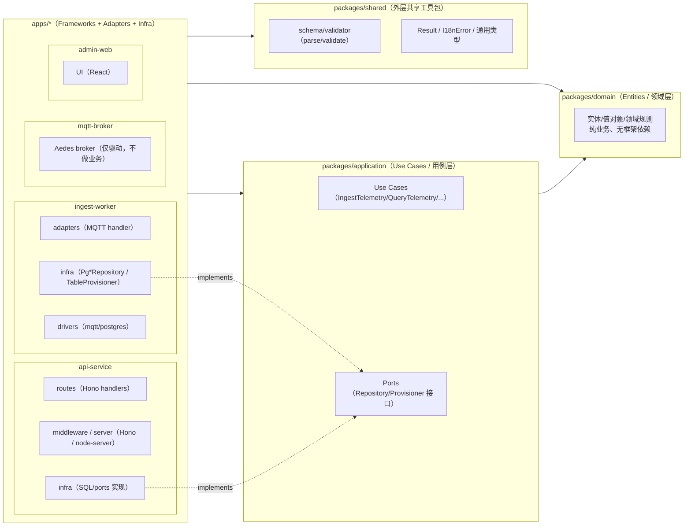
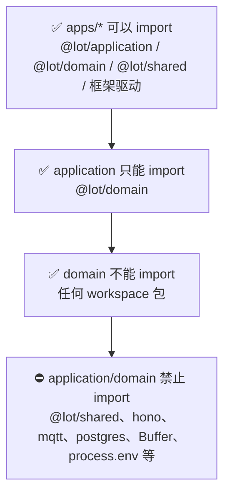
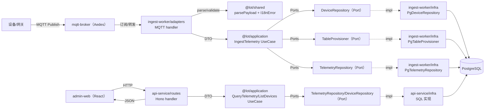
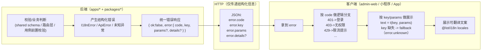
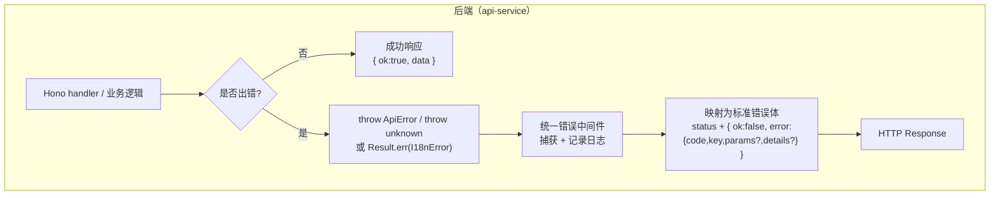

# 架构图：分层边界 / 数据流 / 错误翻译流

本文件将 `docs/architecture.md` 的约束用图形化方式表达，便于团队讨论与代码评审时快速对齐。

## 1) 分层边界与依赖方向（严格模式）

### 依赖红线（严格模式）

## 2) 关键数据流（业务链路）

## 3) 错误流 / 翻译流（code + key/params → t(key, params)）

### 3.1 统一错误契约（后端 → 多端）

### 3.2 后端内部捕获/映射（以 api-service 为例）

### 约束要点（与 ADR-0012 & API 契约对齐）

- 后端错误返回应优先使用可翻译信息：`error.key` + `error.params`（避免返回不可翻译的硬编码 `message`）。
- `error.code` 用于客户端**程序化分支**（跳登录/无权限/限流等）；`error.key/params` 用于**用户可见文案**（`t(key, params)`）。
- 客户端对未知 `key` 必须有降级：例如回退到 `error.unknown`，避免因为 key 拼写/版本不一致导致 UI 崩溃。

